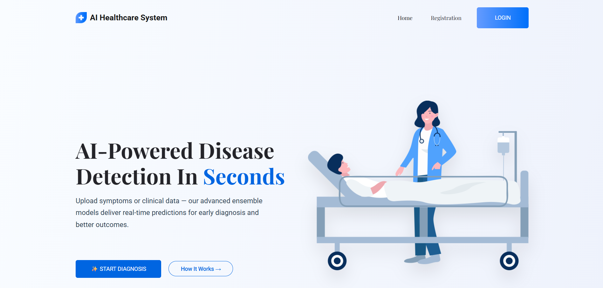
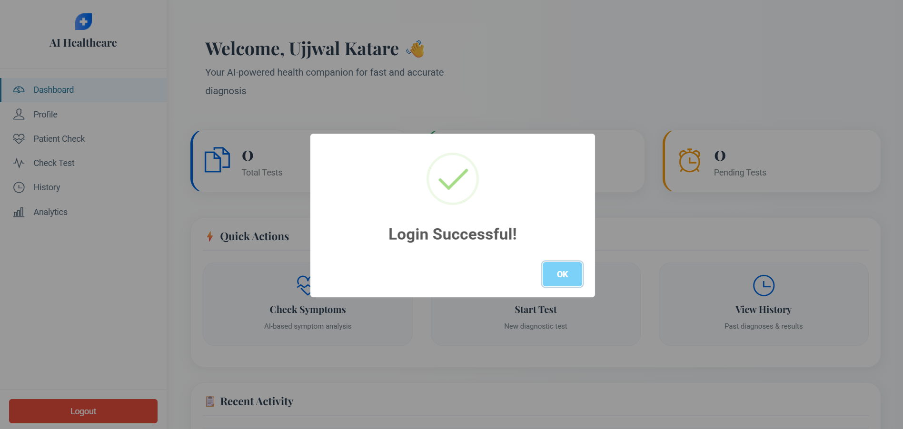
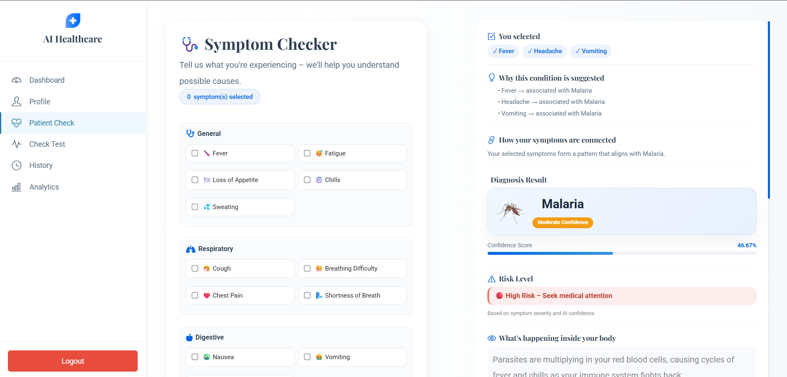
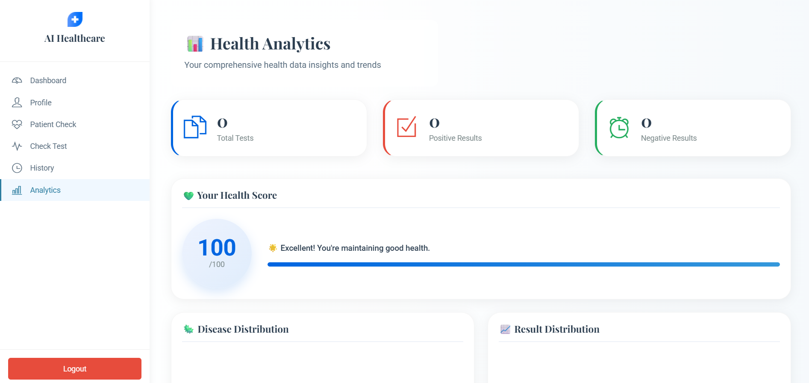
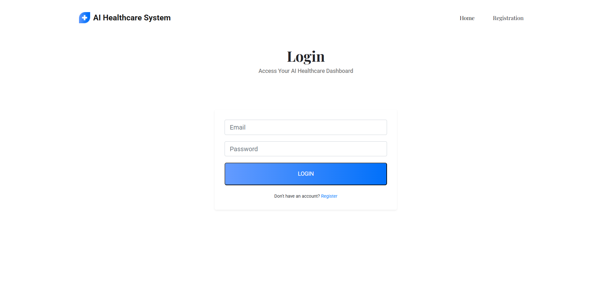

# 🏥 AI Based Disease Diagnosis System

> An intelligent web application that uses Machine Learning & Deep Learning to detect multiple diseases — with AI-powered health guidance after every prediction.



---

## 🚀 Live Demo

🔗 **GitHub Repository:** [ai-based-disease-diagnosis-system](https://github.com/ujjwalkatare/ai-based-disease-diagnosis-system)

---

## 📸 Screenshots

| Dashboard | Symptom Checker |
|-----------|----------------|
|  |  |

| Analytics | Login |
|-----------|-------|
|  |  |

---

## ✨ Features

- 🔐 **Secure Auth** — Register/Login with Aadhaar, email & mobile validation
- 🩺 **Symptom Checker** — AI-powered symptom analysis with Gemini API guidance
- 🧠 **6 Disease Predictions** — Diabetes, Heart, Kidney, Liver, Malaria, Pneumonia
- 📊 **Analytics Dashboard** — Health score, disease trends, result breakdowns
- 📋 **Patient History** — Full test history with search, filter & pagination
- 🤖 **AI Health Advice** — Personalized diet, exercise, precautions & medicine tips after every prediction
- 🗃️ **Smart De-duplication** — 10-minute window prevents duplicate reports

---

## 🧠 ML Models Used

| Disease | Model Type | Input |
|---------|-----------|-------|
| Diabetes | Scikit-learn (Pickle) | Tabular data (8 features) |
| Heart Disease | Joblib (sklearn) | Tabular data (13 features) |
| Kidney Disease | Joblib (sklearn) | Tabular data (25 features) |
| Liver Disease | Joblib (sklearn) | Tabular data (10 features) |
| Malaria | Keras/TensorFlow CNN (`.h5`) | Cell image |
| Pneumonia | PyTorch ResNet-50 (`.pth`) | Chest X-Ray image |

> ⚠️ **Note:** Model files (`*.h5`, `*.pth`, `*.pkl`, `*.joblib`) are **not included** in this repo due to size limits. Download links below.

---

## 🗂️ Project Structure

```
ai_based_disease_diagnosis/
├── app/
│   ├── ml_models/          # Place your model files here (see below)
│   ├── templates/          # All HTML templates
│   ├── static/             # CSS, JS, images
│   ├── models.py           # Patient & PatientHistory DB models
│   ├── views.py            # All prediction & auth logic
│   ├── urls.py             # URL routing
│   ├── symptoms.json       # Symptom-disease mapping
│   └── utils/
│       └── gemini_helper.py
├── media/                  # Uploaded images (runtime)
├── screenshots/            # UI preview images
├── db.sqlite3
├── manage.py
└── requirements.txt
```

---

## ⚙️ Installation & Setup

### 1. Clone the Repository
```bash
git clone https://github.com/ujjwalkatare/ai-based-disease-diagnosis-system.git
cd ai-based-disease-diagnosis-system
```

### 2. Create Virtual Environment
```bash
python -m venv venv

# Windows
venv\Scripts\activate

# Mac/Linux
source venv/bin/activate
```

### 3. Install Dependencies
```bash
pip install -r requirements.txt
```

### 4. Add ML Model Files

Place the following model files inside `app/ml_models/`:

| File | Disease |
|------|---------|
| `diabetes.pkl` | Diabetes |
| `heart_disease_clean_model.joblib` | Heart Disease |
| `kidney_disease_model.joblib` | Kidney Disease |
| `liver_disease_model.joblib` | Liver Disease |
| `malaria_model.h5` | Malaria |
| `best_resnet50.pth` | Pneumonia |

> 📥 **Download Models:** *(Add your Google Drive / HuggingFace link here)*

### 5. Configure Gemini API Key

In `app/utils/gemini_helper.py`, add your Google Gemini API key:
```python
GEMINI_API_KEY = "your-api-key-here"
```

Or set it as an environment variable:
```bash
export GEMINI_API_KEY="your-api-key-here"
```

### 6. Run Migrations & Start Server
```bash
python manage.py migrate
python manage.py runserver
```

Open: [http://127.0.0.1:8000](http://127.0.0.1:8000)

---

## 🔬 Disease Prediction Inputs

<details>
<summary><b>Diabetes</b> (8 inputs)</summary>

Pregnancies, Glucose, Blood Pressure, Skin Thickness, Insulin, BMI, Diabetes Pedigree Function, Age
</details>

<details>
<summary><b>Heart Disease</b> (13 inputs)</summary>

Age, Sex, Chest Pain Type, Resting BP, Cholesterol, Fasting Blood Sugar, Resting ECG, Max Heart Rate, Exercise Angina, Oldpeak, Slope, CA, Thal
</details>

<details>
<summary><b>Kidney Disease</b> (25 inputs)</summary>

Age, BP, Specific Gravity, Albumin, Sugar, RBC, Pus Cell, Pus Cell Clumps, Bacteria, Blood Glucose, Blood Urea, Serum Creatinine, Sodium, Potassium, Hemoglobin, and more
</details>

<details>
<summary><b>Liver Disease</b> (10 inputs)</summary>

Age, Gender, Total Bilirubin, Direct Bilirubin, Alkaline Phosphotase, Alamine Aminotransferase, Aspartate Aminotransferase, Total Proteins, Albumin, Albumin & Globulin Ratio
</details>

<details>
<summary><b>Malaria & Pneumonia</b></summary>

Upload a cell image (Malaria) or chest X-Ray (Pneumonia) for deep learning-based detection.
</details>

---

## 🛠️ Tech Stack

| Layer | Technology |
|-------|-----------|
| Backend | Django (Python) |
| ML/DL | Scikit-learn, TensorFlow/Keras, PyTorch |
| AI Guidance | Google Gemini API |
| Database | SQLite3 |
| Frontend | HTML, CSS, JavaScript |
| Auth | Django Sessions (custom) |

---

## 📦 Requirements

```
django
numpy
pandas
pillow
tensorflow
torch
torchvision
scikit-learn
joblib
google-generativeai
```

Install all at once:
```bash
pip install -r requirements.txt
```

---

## 👤 Author

**Ujjwal Katare**


---

## 📄 License

This project is for educational/academic purposes.

---

## ⭐ Support

If you found this useful, please ⭐ **star the repository** — it helps a lot!
