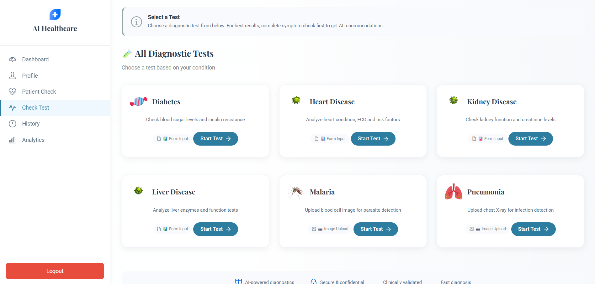

# 🏥 AI Based Disease Diagnosis System

<p align="center">
  
  
  
  
  
  
</p>

<p align="center">
  <b>An intelligent web application that uses Machine Learning & Deep Learning to detect 6 diseases — with personalized AI-powered health guidance after every prediction.</b>
</p>

---

## 🚀 Features

- 🔐 **Secure Auth** — Register/Login with Aadhaar, email & mobile validation
- 🩺 **Symptom Checker** — AI-powered symptom analysis with confidence scoring via Gemini API
- 🧠 **6 Disease Predictions** — Diabetes, Heart, Kidney, Liver, Malaria, Pneumonia
- 📊 **Analytics Dashboard** — Health score, disease trends & result breakdowns
- 📋 **Patient History** — Full test history with search, filter & pagination
- 🤖 **AI Health Advice** — Personalized diet, exercise, precautions & medicine tips after every prediction
- 🗃️ **Smart De-duplication** — 10-minute window prevents duplicate reports
- 🖼️ **Image-Based Detection** — Upload cell images (Malaria) or chest X-Rays (Pneumonia) for deep learning diagnosis

---

## ⚙️ Tech Stack

| Layer | Technology |
|-------|-----------|
| Backend | Django 4.x (Python) |
| Frontend | Bootstrap 5, HTML, CSS, JS |
| Database | SQLite3 |
| ML Models | Scikit-learn, Joblib |
| Deep Learning | TensorFlow/Keras (Malaria), PyTorch ResNet-50 (Pneumonia) |
| AI Guidance | Google Gemini API |
| Auth | Django Sessions (custom) |

---

## 🔬 Disease Prediction & AI Flow

```
SYMPTOM CHECK FLOW:
Patient selects symptoms
    → Weighted scoring against symptoms.json
    → Best-matching disease identified with confidence %
    → Gemini API generates simple, friendly explanation
    → Patient prompted to proceed to specific disease test

PREDICTION FLOW:
Patient fills disease-specific form (or uploads image)
    → ML/DL model runs prediction
    → Result: Positive / Negative + confidence %
    → Gemini API generates full AI health advice
        (Explanation → Diet → Exercise → Precautions → Medicines → When to see doctor)
    → Report saved to PatientHistory DB
    → Smart de-dup: same symptoms within 10 min → update instead of new record

TRANSPARENCY FLOW:
Patient views History
    → All past tests with result, date, disease name
    → Search by disease/symptom, filter by Positive/Negative/Pending
    → Full pagination (10 records per page)
```

---

## 🧠 ML Models Used

| Disease | Model Type | Input Type |
|---------|-----------|------------|
| Diabetes | Scikit-learn `.pkl` | Tabular (8 features) |
| Heart Disease | Joblib `.joblib` | Tabular (13 features) |
| Kidney Disease | Joblib `.joblib` | Tabular (25 features) |
| Liver Disease | Joblib `.joblib` | Tabular (10 features) |
| Malaria | Keras/TensorFlow CNN `.h5` | Cell Image (224×224) |
| Pneumonia | PyTorch ResNet-50 `.pth` | Chest X-Ray (224×224) |

> ⚠️ **Note:** Model files (`*.h5`, `*.pth`, `*.pkl`, `*.joblib`) are **not included** in this repo due to GitHub size limits. Download them using the link below.
>


---

## 👥 Roles & Access

| Role | Access | Capabilities |
|------|--------|-------------|
| **Patient** | Register → Login | Symptom check, disease predictions, view history & analytics, AI health advice |

---

## 🛠️ Local Setup

### 1. Clone the repo
```bash
git clone https://github.com/ujjwalkatare/ai-based-disease-diagnosis-system.git
cd ai-based-disease-diagnosis-system
```

### 2. Create virtual environment
```bash
python -m venv venv
venv\Scripts\activate        # Windows
source venv/bin/activate     # Mac/Linux
```

### 3. Install dependencies
```bash
pip install -r requirements.txt
```

### 4. Add ML Model Files

Place the following files inside `app/ml_models/`:

| File | Disease |
|------|---------|
| `diabetes.pkl` | Diabetes |
| `heart_disease_clean_model.joblib` | Heart Disease |
| `kidney_disease_model.joblib` | Kidney Disease |
| `liver_disease_model.joblib` | Liver Disease |
| `malaria_model.h5` | Malaria |
| `best_resnet50.pth` | Pneumonia |

### 5. Configure Gemini API Key

In `app/utils/gemini_helper.py`:
```python
GEMINI_API_KEY = "your-api-key-here"
```

Or set as environment variable:
```bash
export GEMINI_API_KEY="your-api-key-here"
```

### 6. Run migrations & start server
```bash
python manage.py migrate
python manage.py runserver
```

### 7. Open in browser
```
http://127.0.0.1:8000
```

---

## 📁 Project Structure

```
ai_based_disease_diagnosis/
├── app/
│   ├── ml_models/              # Place model files here (not in repo)
│   ├── models.py               # Patient & PatientHistory DB models
│   ├── views.py                # All prediction, symptom check & auth logic
│   ├── urls.py                 # URL routing
│   ├── symptoms.json           # Symptom-to-disease weighted mapping
│   └── utils/
│       └── gemini_helper.py    # Gemini API integration
├── templates/
│   ├── index.html              # Landing page
│   ├── login.html              # Login page
│   ├── registration.html       # Patient registration
│   ├── dashboard.html          # Patient dashboard
│   ├── patient_check.html      # Symptom checker
│   ├── diabetes.html           # Diabetes prediction form
│   ├── heart.html              # Heart disease prediction form
│   ├── predict.html            # Kidney disease prediction form
│   ├── liver.html              # Liver disease prediction form
│   ├── malaria.html            # Malaria image upload
│   ├── pneumonia.html          # Pneumonia X-Ray upload
│   ├── result.html             # Unified result + AI advice page
│   ├── history.html            # Patient test history
│   ├── analytics.html          # Charts & health analytics
│   └── profile.html            # Patient profile
├── static/                     # CSS, JS, images
├── media/                      # Runtime uploaded images
├── screenshots/                # UI preview images
├── db.sqlite3
├── manage.py
└── requirements.txt
```

---

## 📸 Screenshots

| Home | Dashboard |
|------|-----------|
|  |  |

| Symptom Checker | Analytics |
|----------------|-----------|
|  |  |

| Login | All Symptoms |
|-------|-------------|
|  |  |

---

## 📦 Requirements

```
django
numpy
pandas
pillow
tensorflow
torch
torchvision
scikit-learn
joblib
google-generativeai
```

Install all:
```bash
pip install -r requirements.txt
```

---

## 💡 How AI Guidance Works

1. **Patient runs a prediction** → ML/DL model returns Positive/Negative
2. **Gemini API is called** with disease name + result
3. **Structured advice is generated** covering:
   - What the condition means
   - Diet (Eat / Avoid)
   - Exercise recommendations
   - Precautions to take
   - Medicines (general guidance)
   - When to see a doctor
4. **Advice is saved** to the patient's history record for future reference

This ensures every patient leaves with actionable, personalized health guidance — not just a raw prediction result.

---

## 🔐 Environment Notes

- Gemini API key must be configured before running the server
- Model files must be placed in `app/ml_models/` before starting (app loads them at startup)
- `media/` folder is auto-created at runtime for uploaded images
- Never commit API keys or model files to a public repository

---

## 👨‍💻 Author

**Ujjwal Katare**


---

## ⭐ Give a Star

If this project helped you or you found it interesting, please consider giving it a ⭐ on GitHub!
